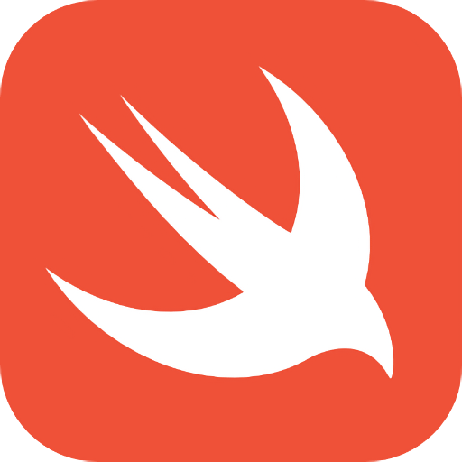
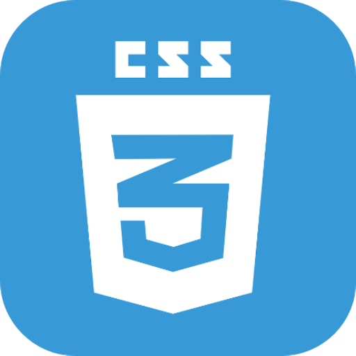
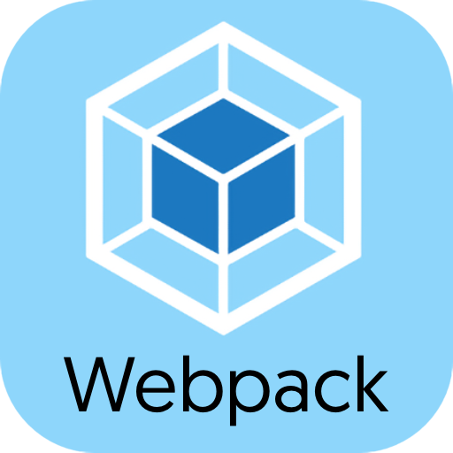
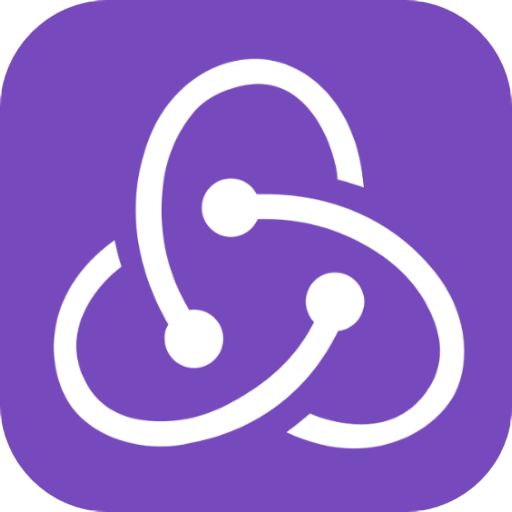
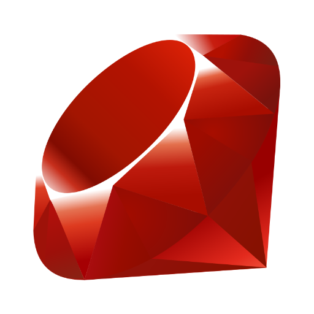
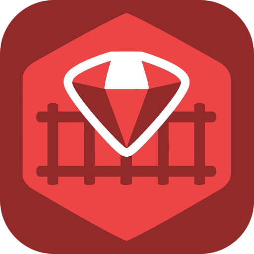
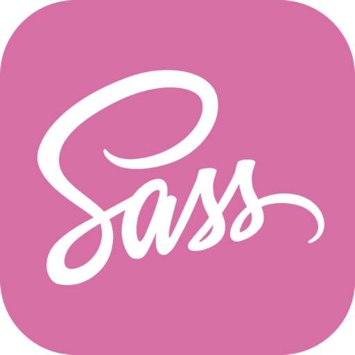
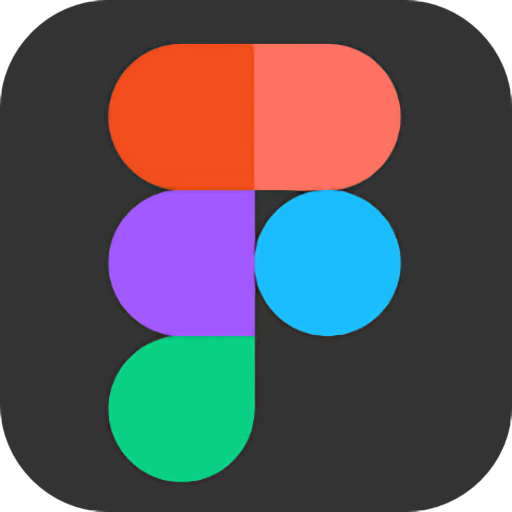
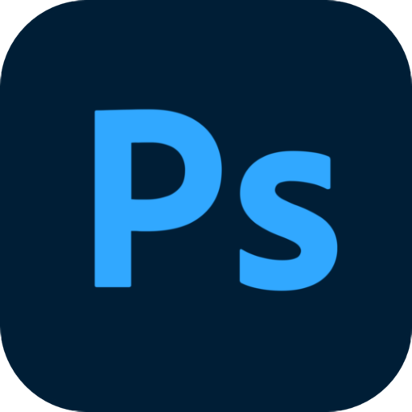

<h1 align="center">Hi there! My name is Augusto</h1>

Hello, my name is Augusto, I am from Peru and I love programming, currently learning JavaScript, HTML, CSS and Swift.

- 📚 I'm currently studying at Microverse.
- 🛠 Learned Swift with Standford and Apple courses.
- ⚡️ Fast learner.
- 👨‍💻 Available for hiring.
- 🤔 Fun fact: I didn't like the language icons available on the internet because they were not uniform, so I decided to make them myself (See below the square icons).

## 🧰 Languages and Tools:

  

  

  

	

<h2>📊 My Stats</h2>

## 🤝 Contact Me:

